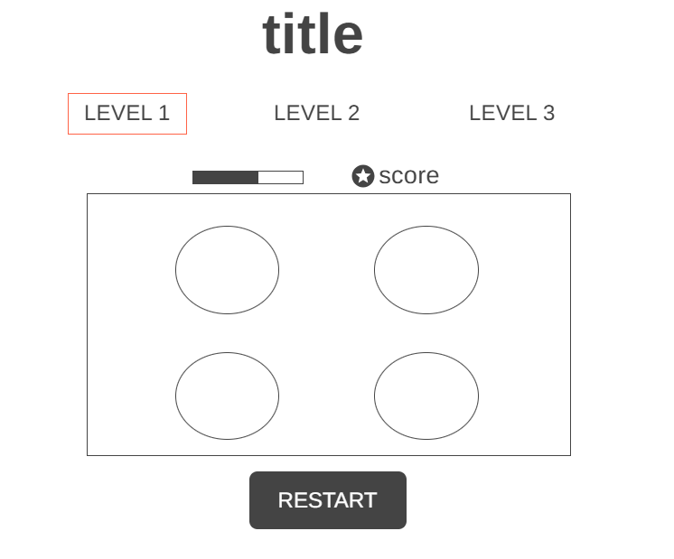

# **Whack-a-Mole Game**

## **_Description_**

Whack-a-Mole is an amusing game, the player should hit (click) on any appearing mole to get a score, there are 3 levels, in each level the required score value increases, the time decreases, and the number of holes increases. If the player completes the 3 levels successfully then there is a winner!

## **_How to Get Started_**

- Click the start button on the main page.
- The game has three levels, by default, the player will begin with level 1.
- The player should click on each appear Mole to get a score.
- A bomb will appear with the Moles, if the player clicks on it, his score will reduce.
- The player has a different limited timer that will reduce at each level, with a specific number of scores the player should reach to move to the next level.
- The holes will increase in each level.
- If the player completes the three levels, then he wins!
- The player can restart the game with the restart button.

## **_Wireframe_**

## **_Credits_**
