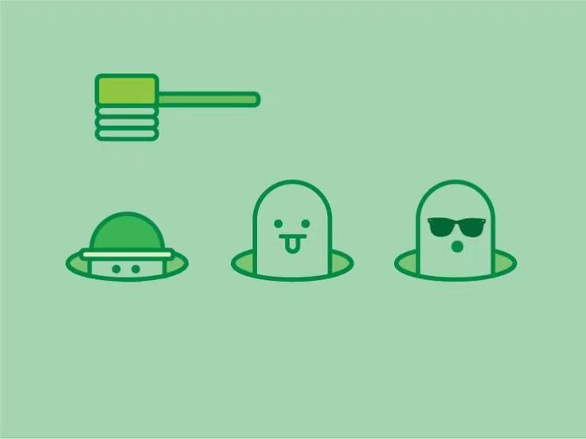
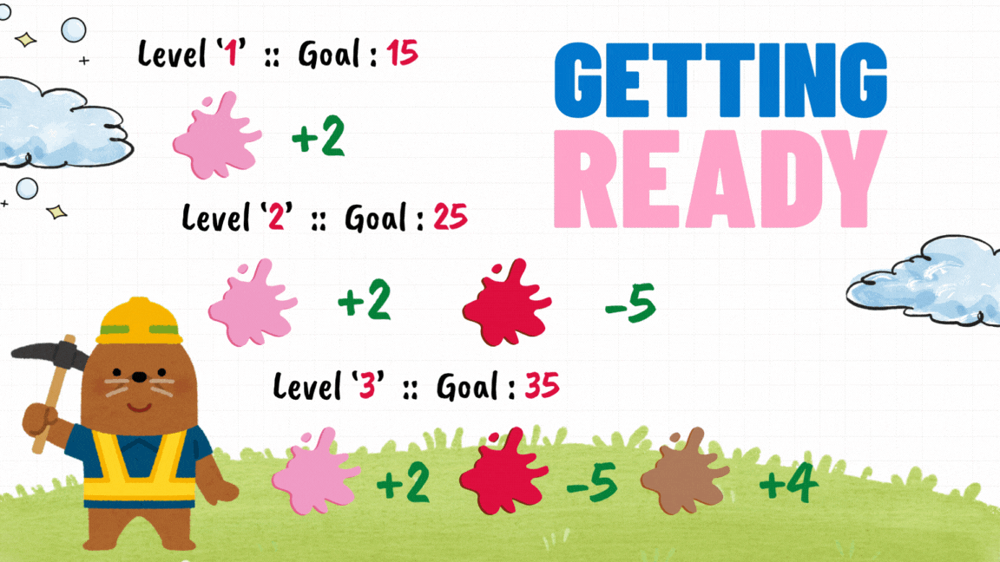
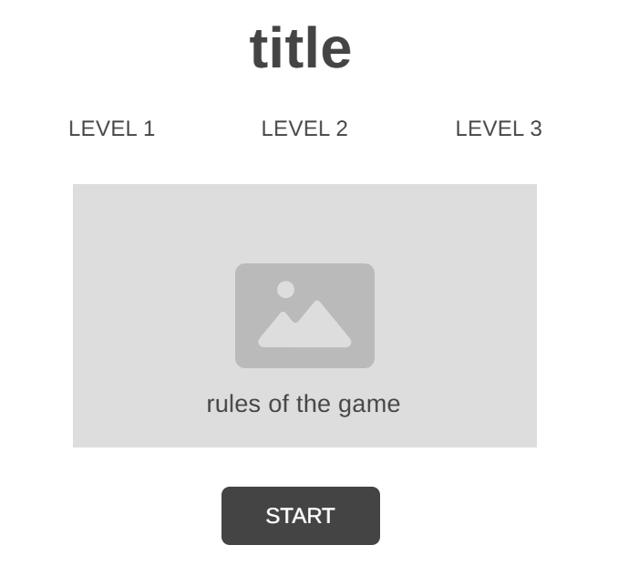
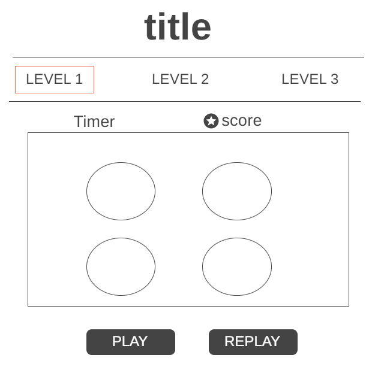

# **Whack-a-Mole Game - Colors Edition**

## 

## **_Description_**

Whack-a-Mole (Colors Edition) is an amusing game, the player should hit (click) on any appearing color to get a score, there are 3 levels, in each level the required score value increases and the number of holes increases. If the player completes the 3 levels successfully then there is a winner!

## **_How to Get Started_**



[Game Link](https://whack-a-mole-game-ga.surge.sh/#)

- Click the start button on the main page.
- The game has three levels, by default, the player will begin with level 1.
- The player should click on each appear Color to get a score.
- A bomb (red color) will appear with the colors, if the player clicks on it, his score will decrease.
- The player has a different limited timer that will reduce at each level, with a specific number of scores the player should reach.
- The holes will increase in each level.
- If the player completes any of the three levels, then he wins!
- The player can replay the game with the replay button.

## **_Wireframe_**

Start Page

## 

Levels Page



## **_Pseudocode_**

```
 -- <Home Page> --
     If (click on start button) then go to the  level 1 page.

-- <levels Pages> --
    gameActive = false until click on the play button.
    targetScore – variable
    Score =0 –  variable
    Fulltime – variable
    curTime – variable
    function for a timer.
    function for the scores (win).
    function for moles and bombs appearing.
    function for initialized the game.
    If(gameActive === true )
    Timer will start
    The moles and bombs start to appear for 3-2 sec
    Each mole and bomb have a value to calculate a score
    If ( score >= targetScore && curTime <= fulltime ) then
    Gameactive = false
    Message box “a winner ,  go to level 2 link in under the title” , then move to the next level link in the nav
    When replay  call a replay  function
    The gameActive will be true again ,  and then  start from the beginning and the reset the score and timer to zero

```

## **_Credits_**

Java Script Reference :

- [js-timimg](https://www.w3schools.com/js/js_timing.asp)

- [js-setInterval](https://www.programiz.com/javascript/setInterval)

- [js-DOM Button](https://www.w3schools.com/jsref/dom_obj_pushbutton.asp)

- [js-set()](https://developer.mozilla.org/en-US/docs/Web/JavaScript/Reference/Global_Objects/Set)

Colors palette :

- [Color hunt](https://colorhunt.co/)

Google fonts :

- [fonts](https://fonts.google.com/selection/embed)
